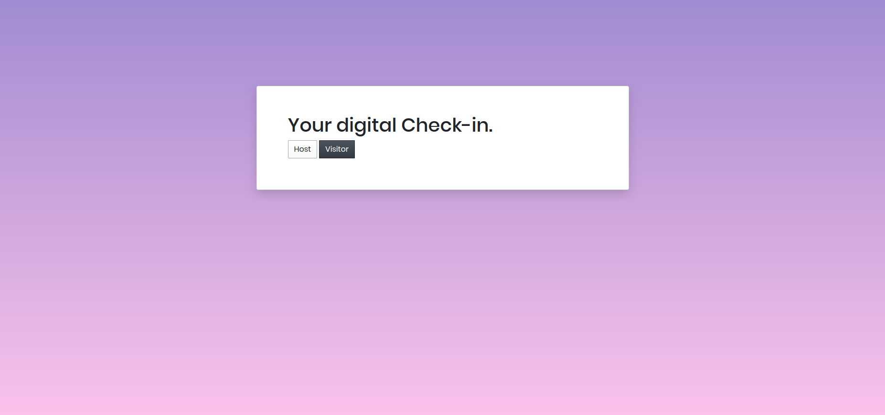
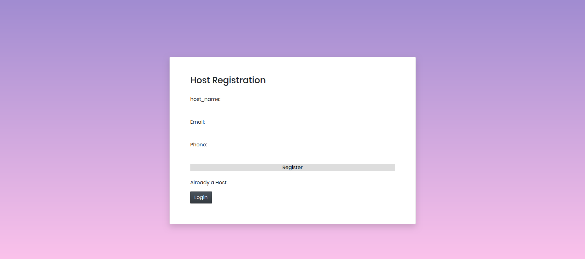
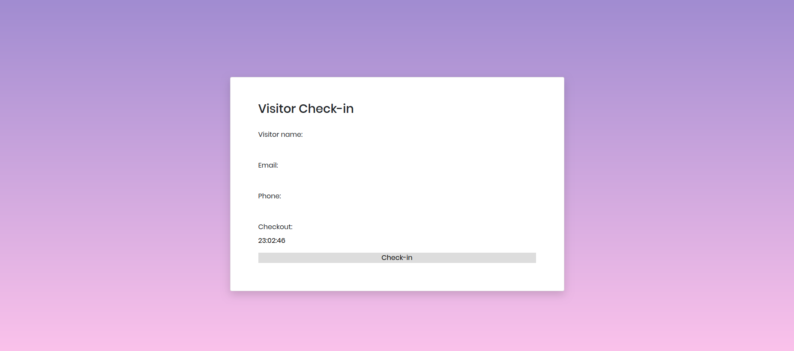
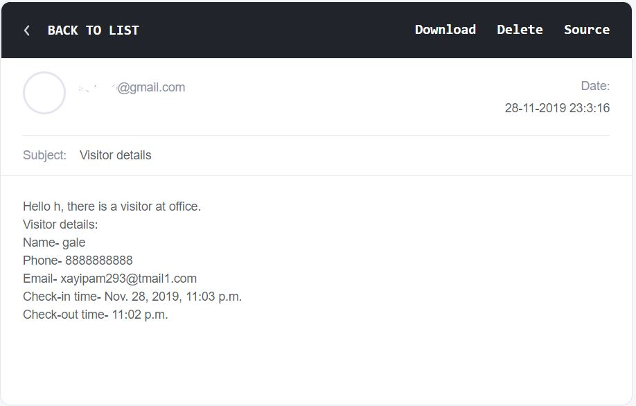
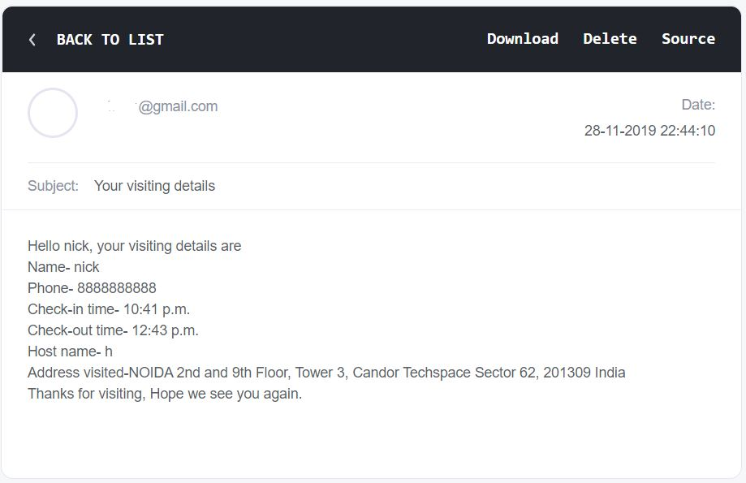

# EMS
A digital entry management system.  
Technology stack - Python, Django , HTML , CSS.  

## Approach-
1.First created django models.py(classes) which defines the schema of the webapp.  
2.This web app uses sqlite3 database to store data.  
3.Then all the funtionalities of the app are implemented in the views.py.  
4.Mails can be sent via django's inbuilt backend mail and SMS's to specific numbers can be triggered by integrating Twillo's rest api.  

