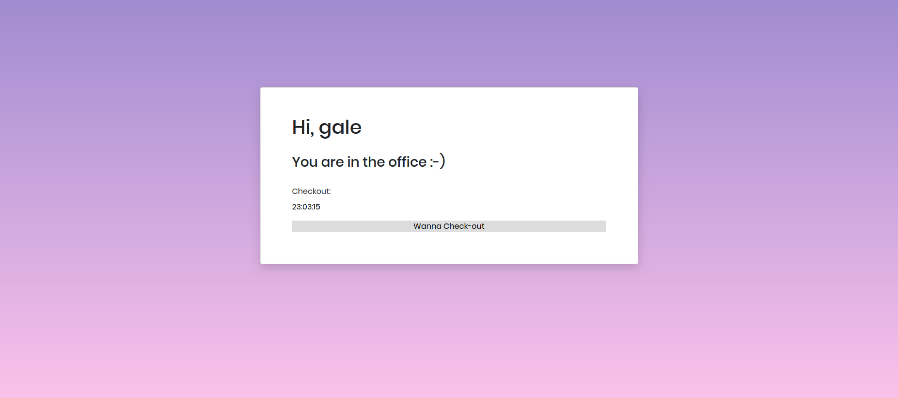

# EMS
A digital entry management system.  
Technology stack - Python, Django , HTML , CSS.  

## Approach-
0.The website is built using python django framework.
1.First I setup the dependencies for app and basic structure of the app.  
2.Then created django models.py(classes) which defines the schema of the website.  
3.This website uses sqlite3 database to store data.  
4.Then all the funtionalities of the app are implemented in the views.py.  
5.Mails can be sent via django's inbuilt backend mail and SMS's to specific numbers can be triggered by integrating Twillo's rest api.  

#### Homepage

#### Host Registration

#### Host Login

#### Host managing panel

#### Visitor Check-in

#### Visitor Check-out;

###### Mail recieved by Host @ check-out of any visitor.

#### Mail recieved by visitor @ check-out.

## To pull and use this system on a device.
1.Install latest version of pip, python, Django.  
2.Become superuser of the app.
3.Use your own database.  
4.Set EMAIL_HOST_USER  and EMAIL_HOST_PASSWORD in the settings.py.  
5.There can be only one host for the system as of now and the details of the host can be changed from the admin panel.  

### Made with ❤ by VikramC.
